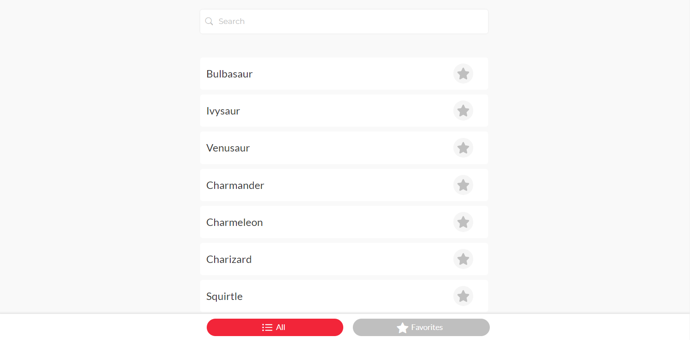
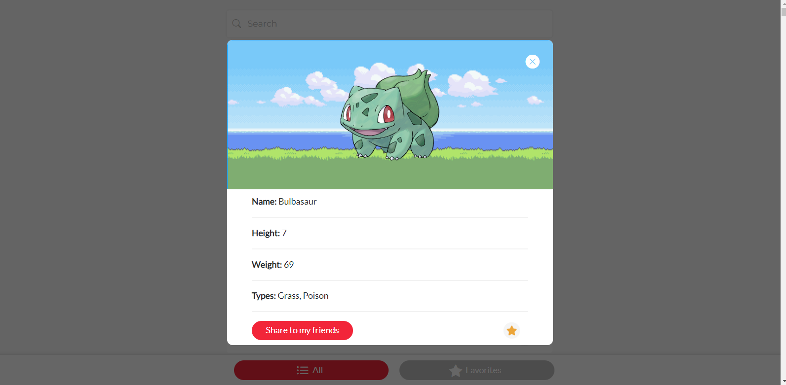
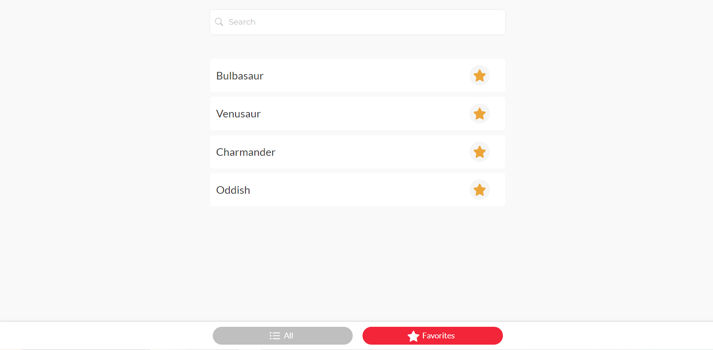
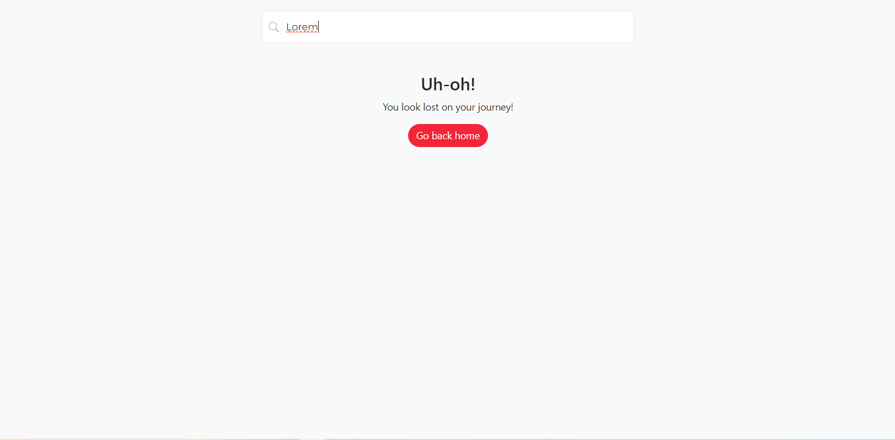

# Pokédex Web App


Este proyecto es una aplicación web que permite a los usuarios buscar y explorar información sobre Pokémon. Los usuarios pueden buscar Pokémon por nombre, ver detalles específicos de cada Pokémon y agregar sus Pokémon favoritos a una lista de favoritos.

## Características

- **Búsqueda de Pokémon:** Los usuarios pueden buscar Pokémon ingresando su nombre en un campo de búsqueda.

- **Lista de Pokémon:** Se muestra una lista de Pokémon con sus nombres y la capacidad de agregarlos a favoritos.

- **Detalles del Pokémon:** Al hacer clic en un Pokémon de la lista, se muestra una ventana emergente con detalles como nombre, altura, peso, tipos y una imagen oficial del Pokémon.

- **Favoritos:** Los usuarios pueden agregar o quitar Pokémon de su lista de favoritos.

- **Compartir Pokémon:** Los usuarios pueden copiar información de un Pokémon para compartirla con amigos.

## Tecnologías utilizadas

- **Vue.js:** Se utiliza el framework Vue.js para crear la interfaz de usuario y gestionar los componentes.

- **Vuex:** Se utiliza Vuex para gestionar el estado global de la aplicación, incluidos los Pokémon favoritos.

- **API de Pokémon:** Se obtiene información sobre Pokémon de la [API de Pokémon](https://pokeapi.co/).

- **HTML/CSS:** Se utilizan HTML y CSS para la estructura y el diseño de la aplicación.

## Instalación y Uso

1. Clona este repositorio en tu máquina local.

   ```bash
   git clone https://github.com/tuusuario/pokedex-web-app.git
Entra en el directorio del proyecto.

bash
Copy code
cd pokedex-web-app
Instala las dependencias.

bash
Copy code
npm install
Inicia la aplicación.

bash
Copy code
npm run serve
Abre tu navegador y ve a http://localhost:8080 para ver la aplicación.

Capturas de Pantalla

Página principal con lista de Pokémon y función de búsqueda.


Detalles de un Pokémon en una ventana emergente.


Lista de Pokémon favoritos.


Detalle cuando no encuentra la busqueda.

## Perfil

Pueden encontrarme en:

- [Luciano Coronel](https://www.linkedin.com/in/luciano-coronel-90503bb8/)
